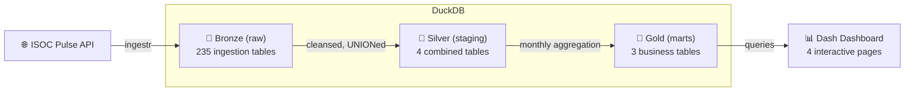

# Internet Health Monitor

A data pipeline and interactive dashboard monitoring the security and accessibility of the internet. Ingests metrics from the Internet Society Pulse API, transforms them through a medallion architecture (Bronze/Silver/Gold), and visualizes trends in IPv6, HTTPS, DNSSEC, and RPKI adoption.

## Overview

This project ingests internet health data from the [Internet Society Pulse API](https://pulse.internetsociety.org/) and transforms it into an interactive web dashboard. It covers 4 scored metrics:

| Metric                | Description                                               | Data Frequency |
| -------------------- | --------------------------------------------------------- | -------------- |
| **IPv6 Adoption**     | Percentage of users who can access the network via IPv6   | Monthly        |
| **HTTPS Adoption**    | Percentage of web traffic using encrypted HTTPS connections | Daily        |
| **DNSSEC Validation** | Percentage of TLDs with valid DNSSEC                      | Daily          |
| **ROA/RPKI**          | Route origin authorization coverage (IPv4 + IPv6 average) | Daily        |

The composite **Health Score** combines IPv6, HTTPS, DNSSEC, and ROA with equal 25% weights.

The dashboard provides four views: global overview with choropleth map, country comparison charts, time-series trends, and metric detail analysis.

## Architecture



## Tech Stack

| Layer              | Tool             | Version             |
| ------------------ | ---------------- | ------------------- |
| Pipeline Framework | Bruin            | latest              |
| Data Warehouse     | DuckDB           | >=1.0.0             |
| Language           | Python           | 3.12                |
| Package Manager    | uv               | latest              |
| Linter/Formatter   | ruff             | >=0.3.0             |
| Type Checker       | ty               | >=0.0.29            |
| Dashboard          | Dash + Plotly    | >=2.14.0 / >=5.18.0 |
| Task Runner        | just             | latest              |
| Testing            | pytest           | >=7.4.0             |
| Containerization   | Docker + Compose | -                   |

## Quick Commands

```bash
# Setup
just setup                    # Install deps + validate pipeline

# Development
just install                  # Install dependencies
just lint                     # Run ruff linter
just format                   # Run ruff formatter
just typecheck                # Run ty type checker
just test                     # Run pytest
just test-cov                 # Run pytest with coverage
just ci                       # Run all CI checks

# Pipeline
just run-pipeline             # Run Bruin pipeline (ingest + transform)
just validate                 # Validate pipeline assets

# Dashboard
just dashboard                # Launch Dash app (http://localhost:8050)

# Docker
just docker-up                # Start dashboard in Docker
just docker-down              # Stop all services
just docker-build             # Build dashboard image
just docker-logs              # View container logs

# Utilities
just clean                    # Clean generated files
just lock                     # Lock dependencies
just generate                 # Regenerate pipeline assets from countries.yaml
just add-country CC [CC ...] # Add countries + regenerate assets
just remove-country CC [CC]  # Remove countries + regenerate assets
just search-country QUERY     # Search countries by name
just list-countries           # List all 249 ISO countries
just list-tracked             # List tracked countries
just check-drift              # CI drift check
```

## Countries

Data is tracked for 47 countries. See `config/countries.yaml` for the full list.

## Dashboard Pages

1. **Overview** (`/`) — 6 KPI cards (Global Health, IPv6, HTTPS, DNSSEC, ROA/RPKI, Countries Tracked) + interactive choropleth map + country rankings; KPI cards auto-color by score threshold
2. **Compare** (`/compare`) — Radar chart (4-axis, filled), grouped bar chart (4 metrics), detailed metrics table (6 columns); reference lines at 50% and 80%
3. **Trends** (`/trends`) — Single country trend + multi-country comparison; metric selector offers IPv6/HTTPS/DNSSEC/ROA-RPKI; **daily resolution preserved** for HTTPS/DNSSEC/ROA trend lines; CSV download available
4. **Detail** (`/detail`) — Geographic map + country rankings + distribution; metric selector offers IPv6/HTTPS/DNSSEC/ROA-RPKI; reference line at 50%

## Configuration

Environment variables (set in `.env`):

```bash
cp .env.example .env  # Then add your ISOC_PULSE_TOKEN
```

| Variable                    | Description                                | Required |
| --------------------------- | ------------------------------------------ | -------- |
| `ISOC_PULSE_TOKEN`          | API token for Internet Society Pulse       | Yes      |
| `TELEMETRY_OPTOUT`          | Set to `true` to disable Bruin telemetry   | No       |
| `INGESTR_DISABLE_TELEMETRY` | Set to `true` to disable ingestr telemetry | No       |

## Prerequisites

- [Python](https://www.python.org/) 3.12
- [uv](https://docs.astral.sh/uv/) — `pip install uv`
- [Bruin CLI](https://bruin-data.github.io/bruin/) — `curl -fsSL https://raw.githubusercontent.com/bruin-data/bruin/main/install.sh | sh`
- [just](https://github.com/casey/just) — `brew install just` (macOS) or `cargo install just`
- [Docker](https://docs.docker.com/get-docker/) — optional, for dashboard container
- `ISOC_PULSE_TOKEN` — get one at [pulse.internetsociety.org](https://pulse.internetsociety.org/)

## Running Locally

```bash
# 1. Install dependencies
just install

# 2. Set up environment
cp .env.example .env  # Add your ISOC_PULSE_TOKEN

# 3. Run the pipeline
just run-pipeline

# 4. Launch the dashboard
just dashboard
```

**Pipeline behavior:** The first run ingests all historical data. Subsequent runs use **incremental loading** — only new data since the last recorded date is fetched from the API, making runs faster and reducing API calls.

Open [http://localhost:8050](http://localhost:8050) in your browser.

## Running with Docker

```bash
# Start dashboard (uses existing data in ./data directory)
just docker-up

# Dashboard available at http://localhost:8050

# Stop services
just docker-down

# Rebuild if needed
just docker-build && just docker-up
```

**Note**: The pipeline runs locally via `just run-pipeline` (requires `ISOC_PULSE_TOKEN`). Docker is for the dashboard only.

## Testing

```bash
just test              # Run all 114 tests
just test-cov          # Run with coverage report
```

| Test File | Tests | Coverage |
|-----------|-------|----------|
| `test_health_scoring.py` | Health score formula and SQL validation | `assets/enrichment/` |
| `test_dashboard.py` | Components, constants, navbar, layouts | `dashboard/` |
| `test_queries.py` | All 6 DuckDB query functions + edge cases | `dashboard/data/` |
| `test_chart_functions.py` | Radar, bar, timeseries, distribution charts | `dashboard/layouts/` |
| `test_layout_errors.py` | Layout error handling (mocked) | `dashboard/layouts/` |
| `test_app.py` | Dash callbacks, routing, helpers | `dashboard/app.py` |

## Health Score Calculation

The composite health score is an equally-weighted average of 4 scored metrics:

```
health_score = (ipv6_score × 0.25) + (https_score × 0.25) + (dnssec_score × 0.25) + (roa_score × 0.25)
```

All scores are on a 0-100 scale (percentage).
